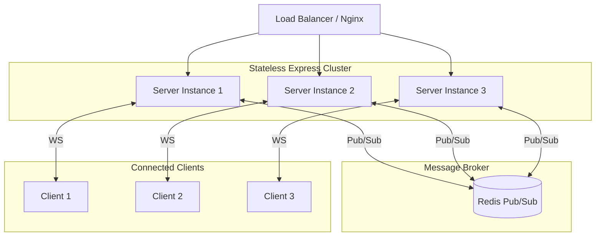

# Realtime Coaching Feed - Production Scalability Plan 🚀

This document outlines the strategic engineering roadmap and system design considerations required to scale the Realtime Coaching Feed application from a few hundred users to **millions of concurrent active clients** worldwide.

---

## 1. Stateful WebSocket Scaling (Horizontal Autoscaling)

### The Challenge
WebSockets establish persistent, stateful TCP connections between a specific client and a specific server instance. In a distributed multi-instance environment (e.g., behind a Load Balancer), if **Coach A** posts an update to **Backend Instance 1**, clients connected to **Backend Instance 2** and **Backend Instance 3** will not receive the update.

### The Solution: Redis Pub/Sub Adapter
To synchronize socket events across independent instances, we implement the **Socket.IO Redis Adapter** (using Redis Pub/Sub).



1. **Broadcast Event Flow**:
   - A coach makes a `POST /api/feed` call, which lands on **Server Instance 1**.
   - **Server Instance 1** invalidates its local/Redis caches and publishes the new feed item payload to the `coaching-feed` Redis Pub/Sub channel.
   - All other active server instances (**Server Instance 2** & **Server Instance 3**) are subscribed to the Redis channel and instantly receive the payload.
   - Each instance then broadcasts the new feed item to its locally connected WebSocket clients.
2. **Load Balancer Configuration**:
   - Use a layer-7 load balancer (e.g., AWS ALB or NGINX) supporting **Sticky Sessions** (via cookies) if HTTP long-polling is permitted.
   - Alternatively, configure Socket.IO on the frontend to bypass long-polling entirely and initiate connection directly via `transports: ['websocket']`. This eliminates HTTP sticky session requirements, easing the load balancer workload.

---

## 2. Multi-Tier Caching Strategy

To deliver sub-millisecond response times under intense traffic spikes, we implement a three-tiered caching architecture.

```
┌─────────────────────────────────────────────────────────────┐
│ 1. Frontend Edge Cache (CDN / Next.js ISR)                  │  <-- Global Edge (TTL: 1 min)
└──────────────────────────────┬──────────────────────────────┘
                               │ (Cache Miss)
                               ▼
┌─────────────────────────────────────────────────────────────┐
│ 2. Backend Distributed Cache (Redis Cluster)                │  <-- High Performance (TTL: 5 min)
└──────────────────────────────┬──────────────────────────────┘
                               │ (Cache Miss)
                               ▼
┌─────────────────────────────────────────────────────────────┐
│ 3. Persistent Database (MongoDB Atlas / Replica Set)        │  <-- Source of Truth (Disk write)
└─────────────────────────────────────────────────────────────┘
```

1. **Edge Caching**: Next.js App Router utilizes incremental static regeneration (ISR) or stale-while-revalidate headers for anonymous/coachee feed views. Edge servers serve pre-rendered feeds immediately.
2. **Redis Cluster Integration**:
   - Scale Redis using a **Master-Replica architecture** with automatic failover (Sentinel or Redis Cluster).
   - Route write operations (cache invalidation) to the Master node.
   - Distribute read queries (fetching cached feed lists) across multiple read-replicas.
3. **Cache Pre-Warming**:
   - When a popular coach goes live or schedules high-traffic coaching events, pre-warm the cache by querying the DB and populating Redis beforehand, avoiding cache stampedes (dogpiling).

---

## 3. Database Scaling & Schema Optimizations

### MongoDB Replica Sets & Sharding
For persistent storage, we utilize MongoDB Atlas configured with a multi-region replica set:
- **Primary Node**: Handles all feed creations (`POST /feed`).
- **Secondary Nodes**: Configured with a `nearest` read preference for geo-distributed coachee feed fetches.
- **Sharding Key**: Once the database exceeds 500GB, shard the collection. We select `coachId` or `messageId` (hashed) as the shard key to distribute feed documents evenly across clusters.

### Indexes for High Performance
To optimize pagination and rapid retrieval, we implement the following indexes in MongoDB:
```javascript
// Compound index to support rapid feed listings sorted by creation time
FeedSchema.index({ createdAt: -1 });

// Unique index to support event deduplication queries
FeedSchema.index({ messageId: 1 }, { unique: true });
```

---

## 4. Operational & Network Tuning

1. **WebSocket Connection Limits**:
   - By default, Linux kernels limit file descriptors (`ulimit -n` is usually 1024). Increase limits on server machines to `65535` or higher to handle thousands of concurrent WebSocket connections per instance.
   - Tune TCP keepalive settings to release dead sockets quickly and reclaim memory.
2. **Compression**:
   - Enable Gzip/Brotli compression for REST responses and compress socket frames using Socket.IO's `perMessageDeflate` to significantly reduce bandwidth overhead.
3. **Graceful Degradation & Backpressure**:
   - Implement rate limiting (e.g., using `express-rate-limit` backed by Redis) on the `POST /feed` endpoint to prevent spam.
   - Provide a REST-polling fallback on the frontend: if the client detects persistent Socket.IO reconnection failures (e.g., due to strict firewalls blocking WebSockets), gracefully fallback to fetching `/api/feed` at regular intervals (e.g., every 30 seconds).
